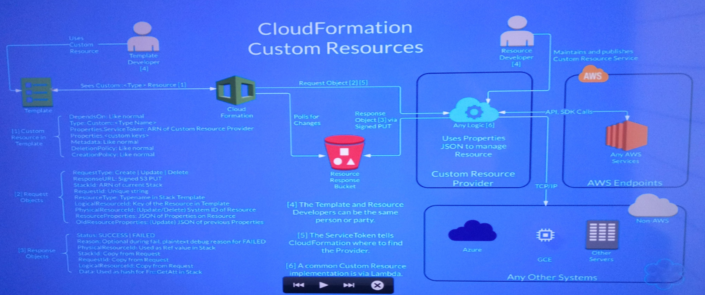

# Advanced Use of AWS CloudFormation

## State Machines
* Dependency Tree
* Parallel creation
* Stack SM
  * Create: Template + Parameters ==CF==> Stack
  * Update: Template + Parameters + Present Stack ==CF==> Stack
  * Delete: Present Stack ==CF==> Nothing
* Resource SM
  * Create: Properties ==Resource Provider Logic==> New Resource
  * Update: Properties + Previous Resource ==RPL==> Fresh Resource
  * Delete: Resource ==RPL==> Nothing
## Data Flow
* DevOps Maturity Level in English

* DevOps Rubric & Scorecard

* Moving Through the levels (AWS)

* Stack Status LifeCycle

* CloudFormation Data Flow

## Lifecycle Demos
* DependsOn
* CI's: Circle CI, Jenkins, worker, etc
* Lambda
* Bash to run the stack and Test it

## Cloudacademy GitHub [Advanced use of cloudformation](https://github.com/cloudacademy/advanced-use-of-cloudformation)
* cfn-wait/example
* nested

## Nested Stacks
* CloudFormation as a resource to another CloudFormation
* CloudFormation Nested Stacks

* User
  * StackAction with parameters --> CloudFormation
  * Master Stack Template --> S3
  * Child Stack Template --> S3
  * CloudFormation take from <-- S3
* Master Stack sees the child stack as just another resource object

## Nested Stacks Demos
* 4 templates
  * Parent.json
  * Child
  * Child B
  * Grand Child
* In bash `$ aws "create stack" use a S3 template "parent.json"`

## Custom Resources
* Steps creating resources
  1. Check for json syntax issues
  2. Validate CloudFormation json schema v4
  3. Resolve DependsOn and implicit dependency order
  4. Interpret FN intrinsic functions
  5. Provide intrinsic variable (pseudo) like regions AWS account Ids
  6. Delegate service call logic to service wrappers
  7. Track stack status and emit events to SNS
* Resource Life Cycle

* Adding custom logic to CloudFormation service wrappers is fairly simple given the CloudFormation is already setup to do a delegation request and receive responses to S3
* CloudFormation Custom Resources

## CloudFormation Resource Demo

 
