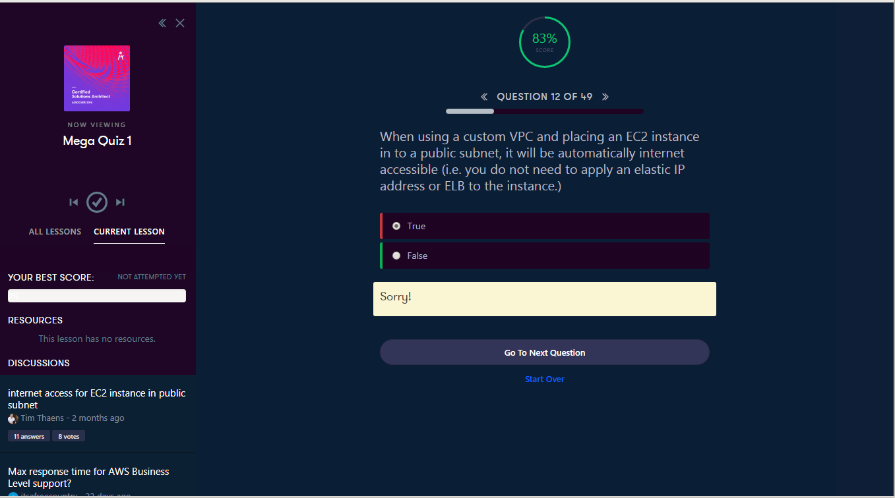
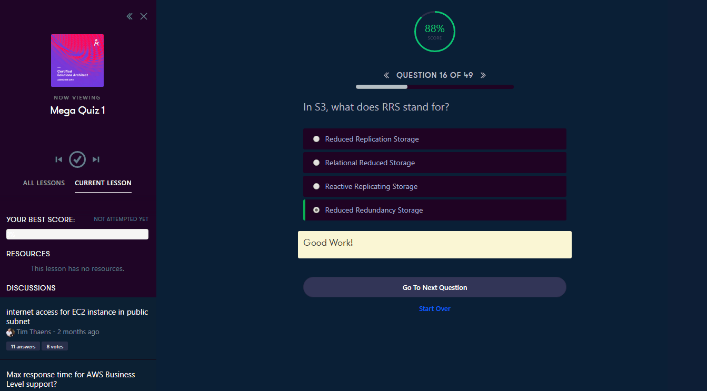
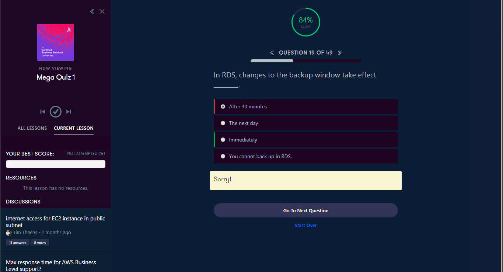
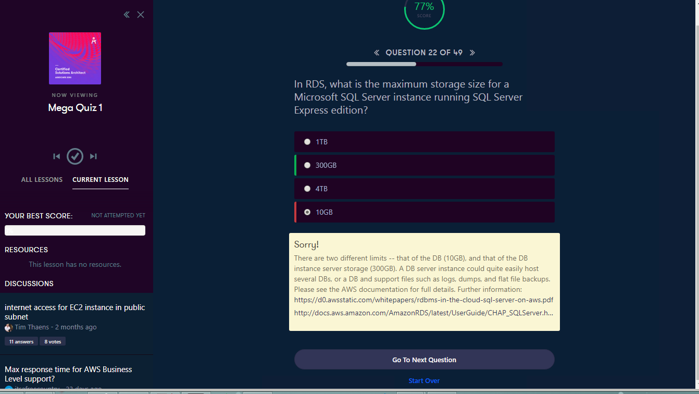
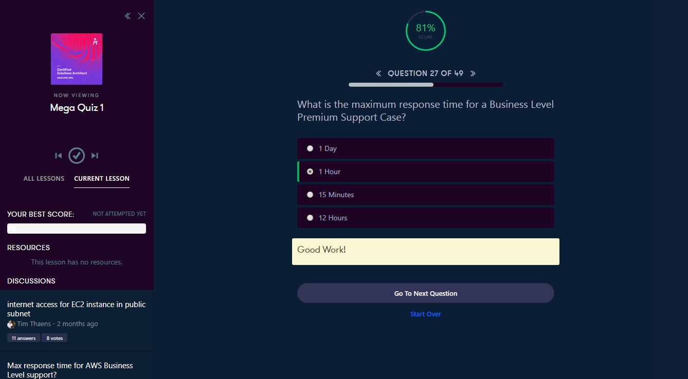
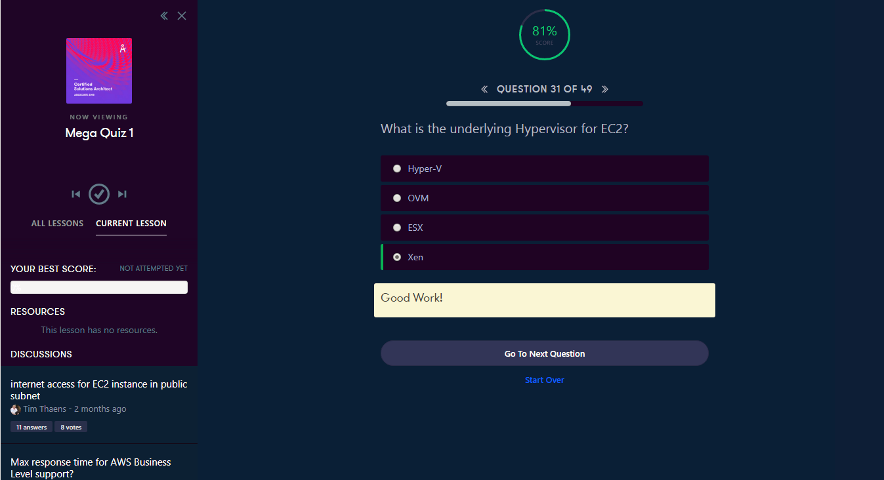
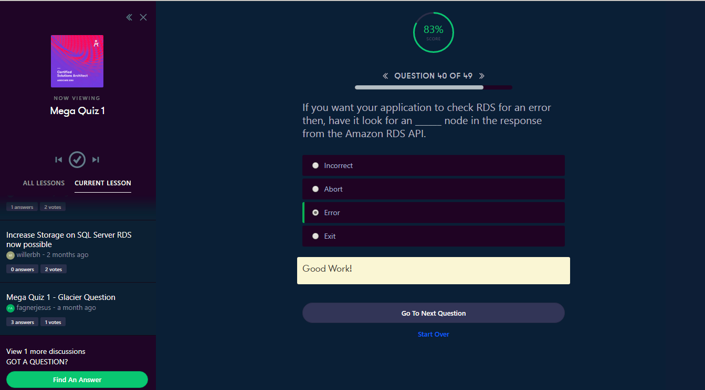
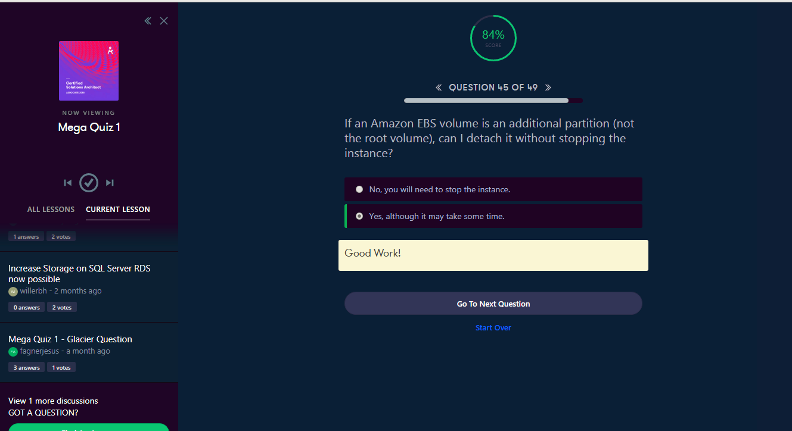

<a id="top" />

# Certified Solutions Architect - Associate 2018
[Course Dashboard](https://acloud.guru/course/aws-certified-solutions-architect-associate/dashboard)

## Content

* [Summaries & Exam Tips. IAM-S3-EC2-R53-RDS-VPC-SQS-SWF-SNS-Kinesis](#summ)
  * [IAM](#summ-iam)
  * [Storage](#summ-storage)
  * [EC2](#summ-ec2)
  * [DNS - Rote 53](#summ-route53)
  * [Databases](#summ-ddbb)
  * [VPC](#summ-vpc)
  * [Application. SQS. SWF. SNS. Elastic Transcoder. Kinesis](#summ-app)

* [Overview of AWS Whitepapers](#wp)
  * [Security](#wp-security)
  * [Risk & Compliance WP](#wp-risk)
  * [Storage Options in the Cloud WP](#wp-storage)
  * [Architecting for the Cloud Best Practices WP](#wp-architecting)
  * [Exam Practicalities](#wp-exam)
  * [Mega Quizz](#wp-exam)

* [Well Architected Framework](#waf)
  * [Pillar One. Security](#waf-security)
  * [Pillar Two. Reliability](#waf-rel)
  * ... pending things ...
  
* [Additional Exam Tips](#tips)
* [Thank You, Good Luck & Coming Soon](#soon)

## Summaries & Exam Tips 
## IAM, Storage, EC2, DND [Route53], Databases, VPC, SQS, SWF, SNS & Kinesis

<a href="#top">Top</a>

### IAM 

<a href="#top">Top</a>

---

---

---

### Storage 

<a href="#top">Top</a>

---

---

---

---

---

---

---

---

---

---

---

---

---

---

---

---

---

### EC2 

<a href="#top">Top</a>

---

---

---

---

---

---

---

---

---

---

---

---

---

---

---

---

---

---

### DNS - Rote 53 

<a href="#top">Top</a>

---

---

### Databases 

<a href="#top">Top</a>

---

---

---

---

---

---

---

---

---

### VPC 

<a href="#top">Top</a>

---

---

---

---

---

---

---

---

---

---

### Application. SQS. SWF. SNS. Elastic Transcoder. Kinesis 

<a href="#top">Top</a>

---

---

---

---

---

---

---

---

---

---

---

---

---

---

---

## Overview of AWS Whitepapers 

<a href="#top">Top</a>

---

---

---

---

---

---

---

### Security 

<a href="#top">Top</a>

---

---

---

---

---

---

---

---

---

---

---

---

---

---

---

---

---

---

---

---

---

---

### Risk & Compliance WP 

<a href="#top">Top</a>

---

---

---

---

### Storage Options in the Cloud WP 

<a href="#top">Top</a>

---

---

---

---

---

---

---

---

### Architecting for the Cloud Best Practices WP 

<a href="#top">Top</a>

---

---

---

---

---

---

---

---

### Exam Practicalities 

<a href="#top">Top</a>

---

---

---

---

### Mega Quizz 

<a href="#top">Top</a>

---

---

---

---

---

---

---

---

---

---

---

---

---

---

---

## Well Architected Framework

<a href="#top">Top</a>

---

---

---

---

### Pillar One. Security 

<a href="#top">Top</a>

---

---

---

---

---

---

---

---

---

---

---

---

---

---

---

---

---

### Pillar Two. Reliability 

<a href="#top">Top</a>

---

---

---

---

---

---

---

---

---

---

---

---

---

---

---

## Additional Exam Tips

<a href="#top">Top</a>

additional-exam-tips/

## Thank You, Good Luck & Coming Soon

<a href="#top">Top</a>

coming-soon/

