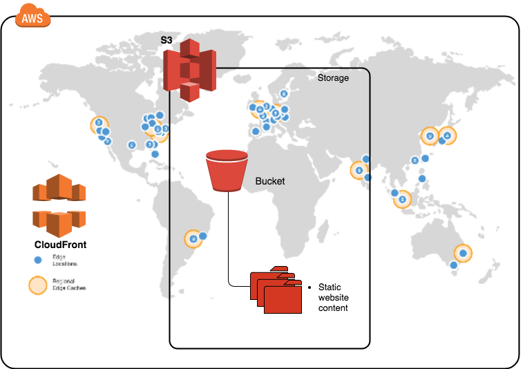
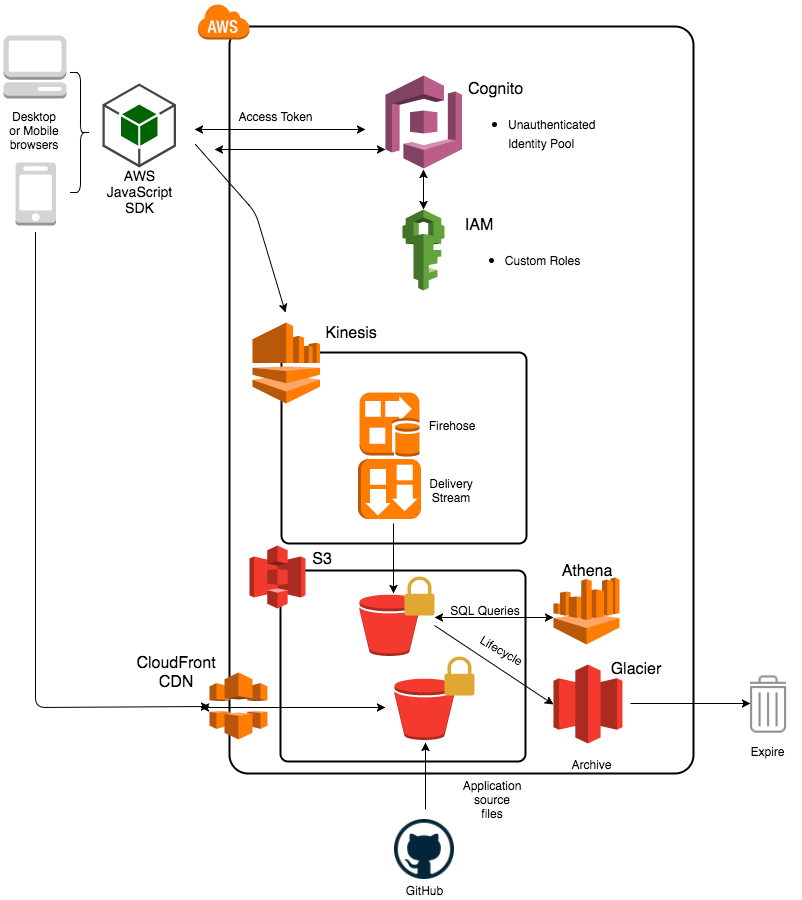
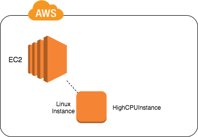
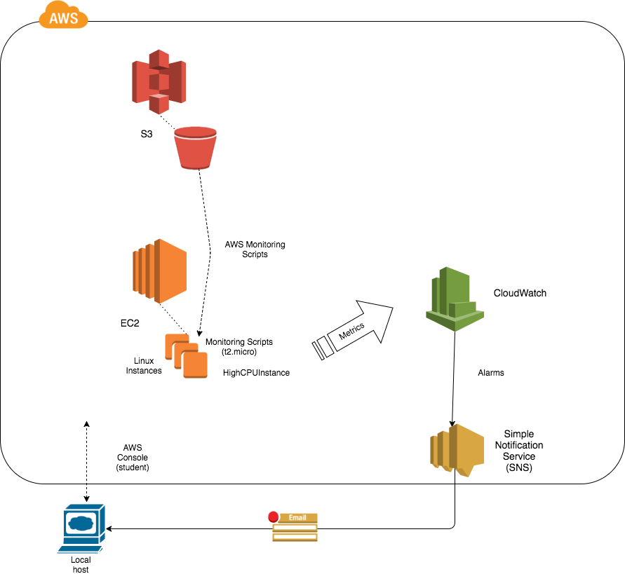
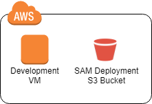
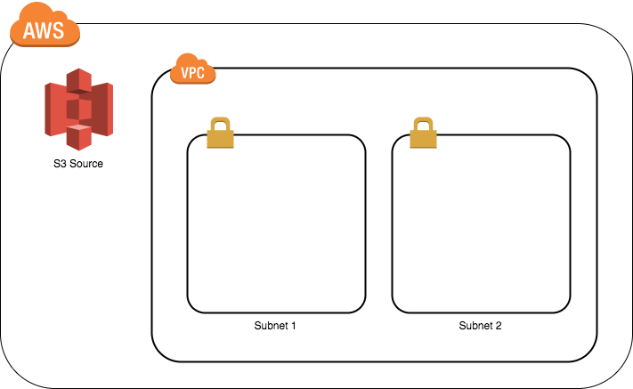
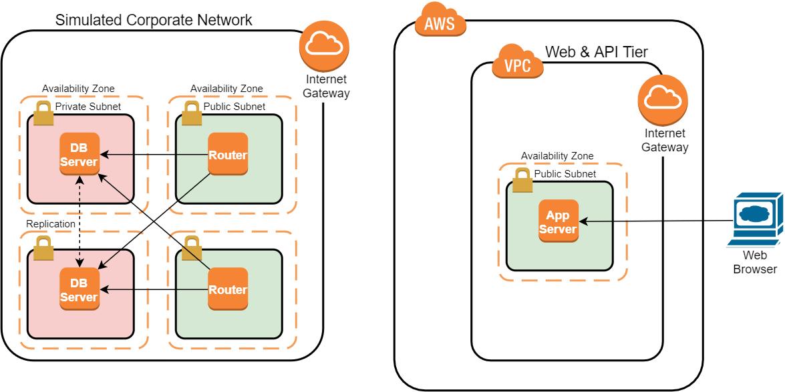

# Labs Diagrams

* 3d-auto-scaling-group

* authentication-with-aws-cognito

* bastion-host-with-nat-instance

* configuring-static-website-s3-and-cloudfront

* create-your-first-amazon-s3-bucket

* deploy-highly-available-serverless-application-using-aws-services-after

* develop-and-deploy-an-application-with-aws-codestar-01-before-lab

* develop-and-deploy-an-application-with-aws-codestar-02-after-lab

* follow-best-practices-with-aws-trusted-advisor-01-before-lab

* follow-best-practices-with-aws-trusted-advisor-02-after-lab

* getting-started-amazon-simple-notification-service

* getting-started-with-amazon-aurora-database-engine-01-before-lab

* getting-started-with-amazon-aurora-database-engine-02-after-lab

* getting-started-with-amazon-redshift-01-before-lab

* getting-started-with-amazon-redshift-02-after-lab

* hands-cloudformation-deploy-scalability-final-template.template.

* hands-cloudformation-deploy-scalability

* introduction-aws-iot-01

* introduction-aws-iot-02

* introduction-to-cloudwatch-01

* introduction-to-cloudwatch-02

* monitor-amazon-cloudwatch-logs-for-failed-ssh-attempts

* monitoring-aws-cloudtrail-events-aws-cloudwatch

* query-encrypted-amazon-s3-data-amazon-athena

* securing-your-vpc-using-public-and-private-subnets-with-network

* serverless-web-development-python-01-before-lab

* serverless-web-development-python-02-after-lab

* using-amazon-ecs-for-blue-green-deployments-01-before-lab

* using-amazon-ecs-for-blue-green-deployments-02-after-lab

* using-amazon-key-management-service-encrypt-s3-and-ebs-data

* using-ec2-spot-instances-01

* using-ec2-spot-instances-02

* vpc-peering-01-end-goal-but-no-lab-goal

* vpc-peering-02-goal-for-the-lab

* vpc-peering-03-lab-starting-point

* vpn-connections-with-amazon-virtual-private-cloud-dynamic-routing-01-before-lab

* vpn-connections-with-amazon-virtual-private-cloud-dynamic-routing-02-after-lab

* working-amazon-ec2-auto-scaling-groups

