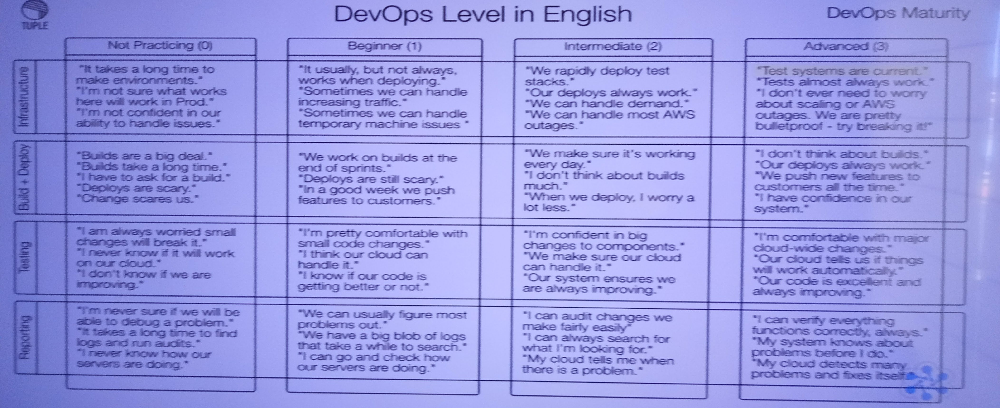

# Advanced Use of AWS CloudFormation

## State Machines
* Dependency Tree
* Parallel creation
* Stack SM
  * Create: Template + Parameters ==CF==> Stack
  * Update: Template + Parameters + Present Stack ==CF==> Stack
  * Delete: Present Stack ==CF==> Nothing
* Resource SM
  * Create: Properties ==Resource Provider Logic==> New Resource
  * Update: Properties + Previous Resource ==RPL==> Fresh Resource
  * Delete: Resource ==RPL==> Nothing
## Data Flow
* DevOps Level in English
