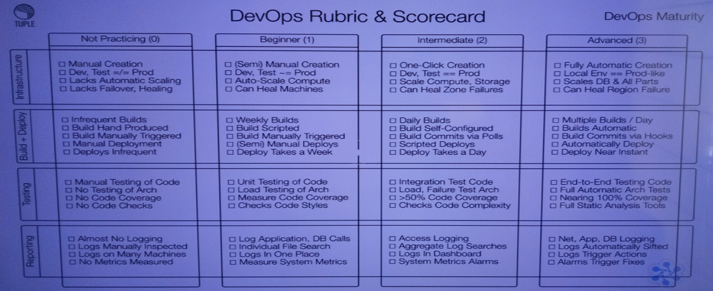
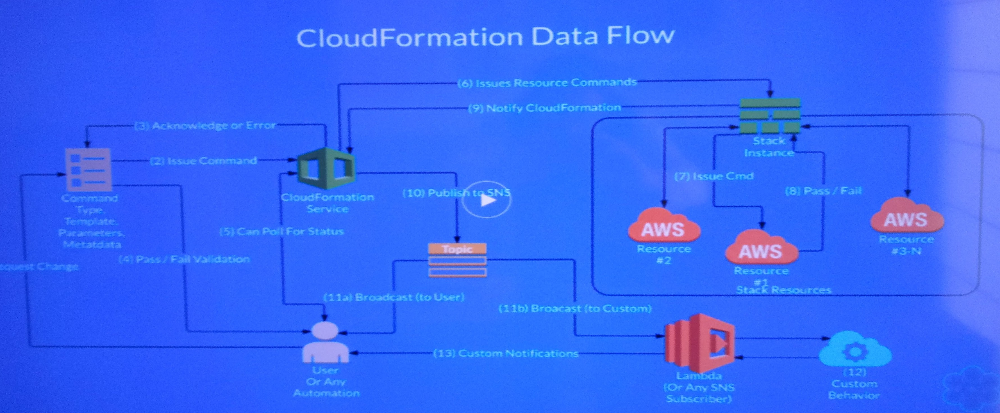

# Advanced Use of AWS CloudFormation

## State Machines
* Dependency Tree
* Parallel creation
* Stack SM
  * Create: Template + Parameters ==CF==> Stack
  * Update: Template + Parameters + Present Stack ==CF==> Stack
  * Delete: Present Stack ==CF==> Nothing
* Resource SM
  * Create: Properties ==Resource Provider Logic==> New Resource
  * Update: Properties + Previous Resource ==RPL==> Fresh Resource
  * Delete: Resource ==RPL==> Nothing
## Data Flow
* DevOps Maturity Level in English

* DevOps Rubric & Scorecard

* Moving Through the levels (AWS)

* Stack Status LifeCycle

* CloudFormation Data Flow

## Lifecycle Demos
* DependsOn
* CI's: Circle CI, Jenkins, worker, etc
* Lambda
* Bash to run the stack and Test it

