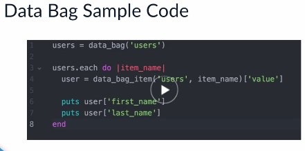

 
Course

# [Getting Started With Chef](https://cloudacademy.com/cloud-computing/getting-started-chef-course/)

## Course INtro

* Learning objectives
  - Understand the use cases for Chef
  - Explain the Chef Architecture
  - Describe the components of Chef
  - Create a simple cookbook

* GitHub course code
https://github.com/whelmed/getting_started_with_chef

## Concepts

### Overview
* Chef before opscode
* Success story. "Gannett", "FB", "Intuit"

### A high level architecture
* The chef workstation (CDK) --> The CHef Server --> Nodes
* Chef Development Kit
* Chef executable
* Chef-client executable
* Ohai get info about the nodes
* Knife use to interact with Chef Server and bootstrap the chef-client onto nodes
* Kitchen. Test your code. Supports aws, azure, google, docker, vagrant
* Berkshelf. A dependency management tool
* Node. Generic name for device

### The anatomy of a cookbook
* Chef Repo
  - .chef/
  - cookbooks/
	- fake.cookbook.1/
	  - attributes/
	  - recipes/
	  - definitions/
	  - files/
	  - libraries/
	  - resources/
	  - metadata.rb
	  - templates/
  - data_bags/
  - environments/
  - nodes/
* Recipes
  - Configuration code
  - Ruby
  - based on resources
* Resources
  - package 'nginx' do action :install end
  - service 'nginx' do action [:enable, :start]
* Custom Resources
  - from v 12.5
* Definitions
  - Previous 12.5 resources
  - like compile-time macros
* Attributes
  - like variables
  - details about nodes states
  - ex. IP, MAC, host, etc.
  - Set in cookbook, role, env or Ohai
  - type of attributes
    - **default**
	- force-default
	- normal
	- override
	- force-override
	- **automatic**
  - attibutes sources
    - Nodes
	- Attribute files
	- recipes
	- environments
	- Roles
  - example default['database']['username'] = 'db-user'
* Files
  - just files to copy
* Templates
  - like files with logic added <%=  %>
  - ERB templates with eRubis template files
* Libraries
  - Ruby code
* Metadata.rb
  - details about the cookbook

### The Recipe DSL
* Pattern 
  - Name
  - Resource type
  - Attribute
  - Action
  - ex. package 'type' do  
  		  version '1.7.0-3'  
  		  action :install  
  	    end  
  - You can use if/then/case
  - Attribute methods
  - Data_bag method
  - data_bag_item method
  - ex.  
      data_bag('users').each do |user|  
          data_bag_item('users, user')  
      end  
  - shell our. Open a shell to run commands

## Practical

### Setup
* Explain everything to install
  - VirtualBox
  - Vagrant
  - Chef DK

### Your First recipe
(Code at Github)[https://github.com/whelmed/getting_started_with_chef]

1. run `$ chef verify`
1. cd to chef repo parent folder
1. run `$ chef generate repo ca_repo`
1. open folder with sublime
1. two ways to generate cookbook
   * `$ chef generate cookbook` (shorter minimalist including tests directories)
   * `$ knife cookbook create` (wider)
1. cd to cookbooks folder into the chef repo already created
1. run `$ chef generate cookbook learn_chef_cookbook`
1. move to ca_repo/cookbook/learn_chef_cookbook
1. add apt_package to recipes/default.rb file
1. edit .kitchen file 'platforms, box & network to forward ports'
1. run `$ kitchen converge`
1. add file resource index.html file to to recipes/default.rb file
1. To run the tests
   * run `$ kitchen converge`
1. check on browser at http://localhost:8081. apache 2 ubuntu default page
1. add file resource to default.rb file
1. run `$ kitchen converge`

### Refactoring your recipe
Made the refactor at the same cookbook learn_chef_cookbook

### Deploying a Web Application
The app is a flask LAMP with simple frontend  

1. create new web_app recipe
1. add link to supermarket in Berksfile file
1. add dependencies to metadata.rb file
1. run **`$ kitchen destroy`**
1. test the application already deployed on ubuntu at http://localhost:8081
1. test the application already deployed on centos at http://localhost:8082

### Setting Up the Chef Server
* Install on AWS
* Ports 22, 443 & 8443
* Chef server listen on 443
* 1 hour window to create first user
* Organization is root access
* Download Key, resetting existing one. Move Key to chef-repo/.chef. Use the key in dev machine (chef. workstation) to interact with chef server
* At ca-repo/.chef/files/knife.rb
  - client-key
  - chef-server-url
  - https://url/organization/org_abrev
* `$ knife ssl fetch`. For download chef server's ssl certificate.
* look new folder repo/.chef/trusted_certs
* `$ knife list`. (some files)
* `$ knife list clients` (one file)

### Setting Up Nodes
* Create 3 VMs nodes on AWS. Open ports 80 & 22:
  - Ubuntu 14
  - Ubuntu 16
  - Centos 7 (AMI from marketplace)
* Install chef-client in a node is called "bootstrapping" the node
* There is an unattended installarion :(not explained)
* Do it for each node:
```bash
  $ knife bootstrap client.node.hostname
     -i ~/.ssh/max-key-pair.pem
     -N ubuntu1604
     -x ubuntu --sudo
```
* `$ knife list nodes`
* look at server web page / nodes

### Configuring The Nodes

```bash
cd repo/cookbooks/web_app
berks install  # download the related community cookbooks
ls ~/.berkshelf/cookbooks/
# Is possible to use knife to upload cookbooks
```

* Signed ceritificate
  - You must use it for every prod environment
  - Two ways to use unsigned certs
    * `--no--ssl-verify` parameter with each call
    * `$ echo '{"ssl":{"verify":false}}' > ~/.berkshelf/config.json  `
    * `cat ~/.berkshelf/config.json`

```bash
berks upload    # Now in server web page you can see cookbooks
```

* Which recipes for which nodes
* `$ knife node run_list set ubuntu1604 'recipe[web_app]'` repeatning for each node.
* You can see server web pages/nodes/recipes
* Now run the chef-client on the node
* It is possible on cron, etc.
```bash
  $ knife ssh "name:ubuntu1404" "sudo chef-client"
     -x ubuntu
     -a ec2.public.hostname  # it is an Attribute!
     -i ~/.ssh/max-key-pair.pem
```
* "name:ubuntu1404" --> follow the knife search command syntax
* look nodes/attributes on server website from "OHAI"

### Roles and Data Bags
* Roles
  - ex. front-end, back-end, database
  - can be combined
  - role run_list instead of a node
  - chef-repo/roles  json or rb
  - look the foldes
  - copy file example.json to webapp.json
  - change 'description', 'name', 'run_list'
  - `$ knife role from file ../../roles/webapp.json`
  - see it servfer/roles
  - `$ knife node run_list set ubuntu1404 'role[webapp'`
  - see on server/nodes/runlist/webapp
  - changing 'knife search syntax for "role:webapp"
```bash
  $ knife ssh **"role:webapp"** "sudo chef-client"
     -x ubuntu
     -a ec2.public.hostname  # it is an Attribute!
     -i ~/.ssh/max-key-pair.pem
```
* Data Bags
  - for secrets (keys, etc) use chef-vault instead of bags
  - repo/data_bags into do `$ mkdir /users`
  - add file max.json. Id is required
```js
  {
    id: 'max',
    value: {
    	'first': 'max',
    	'last': 'Aldunate'
    }
  }
```
  - copy andy.json and change data
```bash
$ knife data bag create users
$ knife data bag from file users ../../data_bags/
$ knife data bag list
$ knife data bag show users
$ knife data bag show users max
```
  - Look code using data bag


### Summary
* Read source code for popular cookbooks on [chef supermarket](https://supermarket.chef.io/dashboard)
