# Solution Architect Associate for AWS - 2017 Exam Primer

[Course at Cloudacademy.com](https://cloudacademy.com/amazon-web-services/solution-architect-associate-for-aws-course/)

## Latest Exam Primer
  
  
  
  
  
  
  
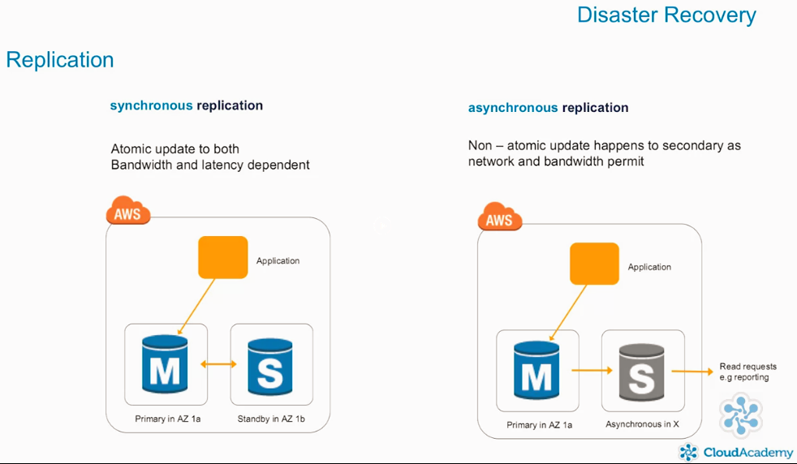  
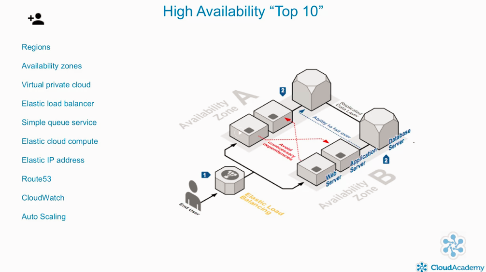  
  
  
  
  
  
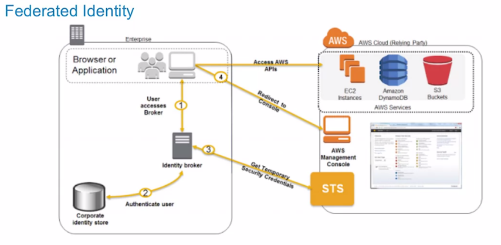  
  
  
  
  
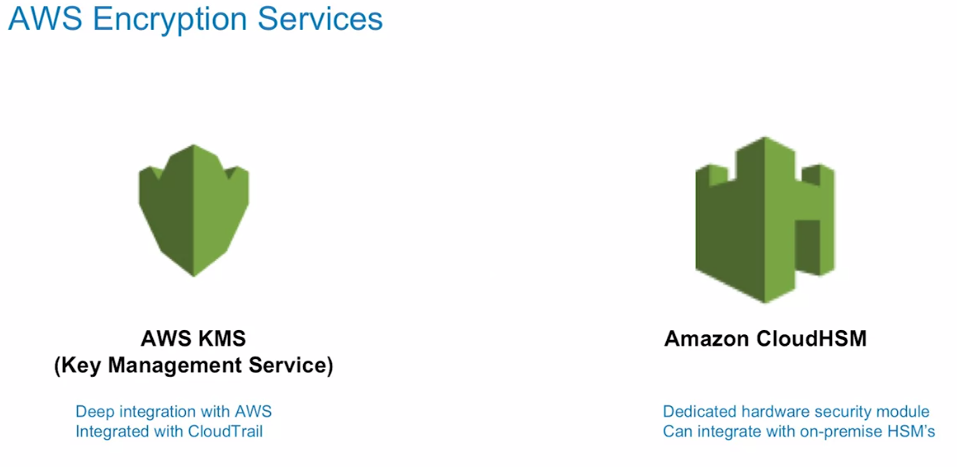  
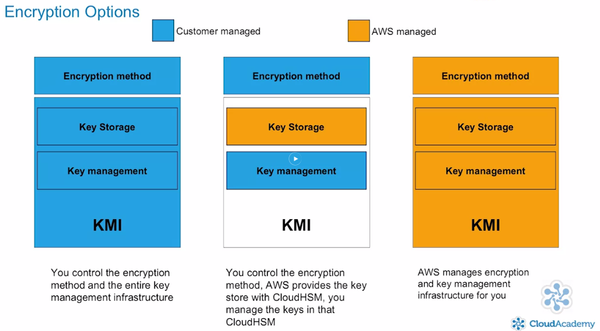  
  
  
  
  
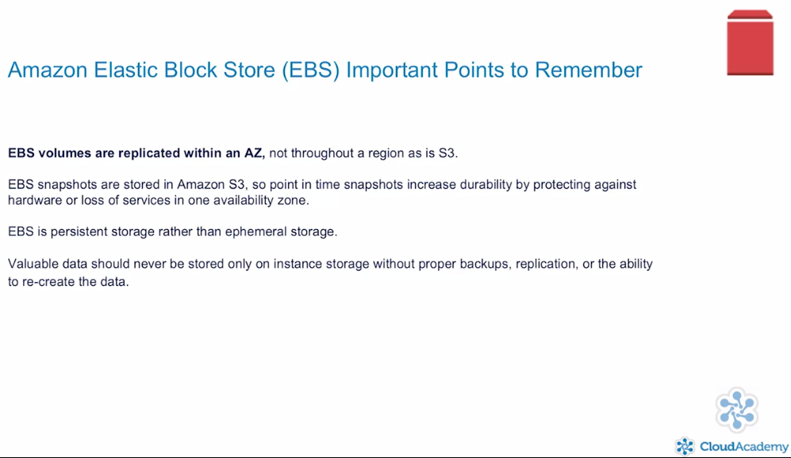  
  
  
  
  
  
  
  
  
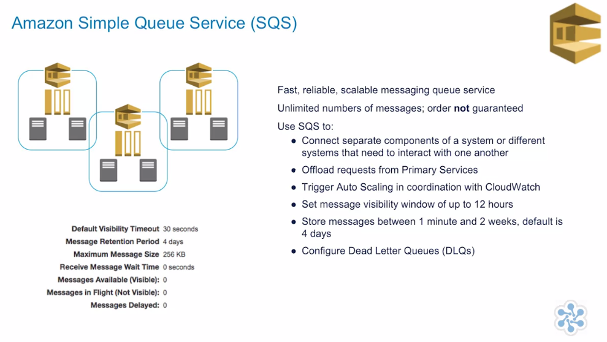  
  
  
  
  
  
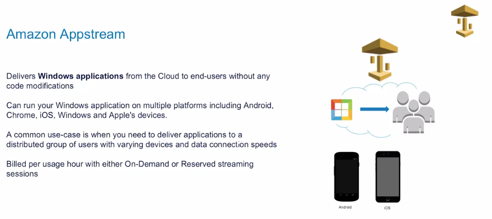  
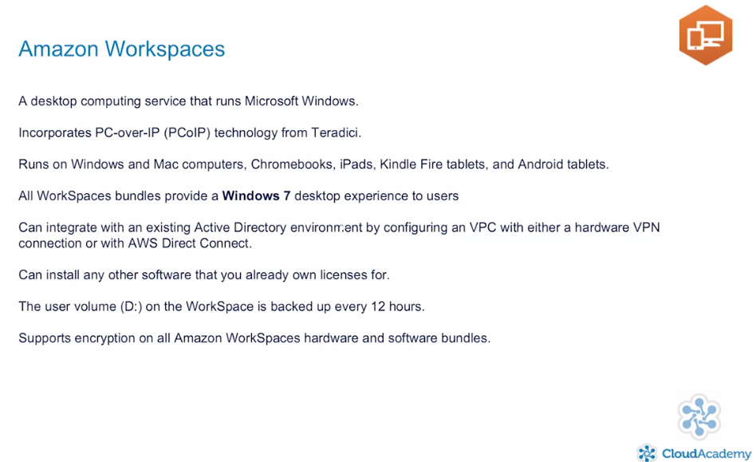  
  
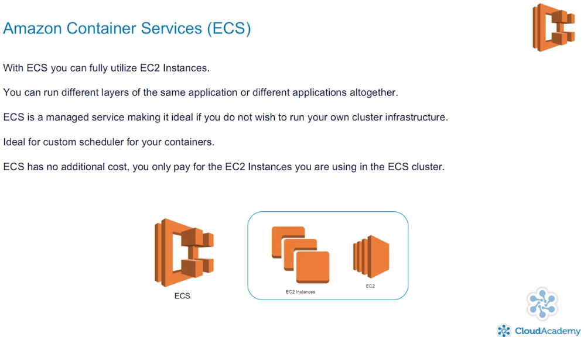  

## Exam Prep - Domain One
### High Availability
  
### Auto Scaling
  
### ELB
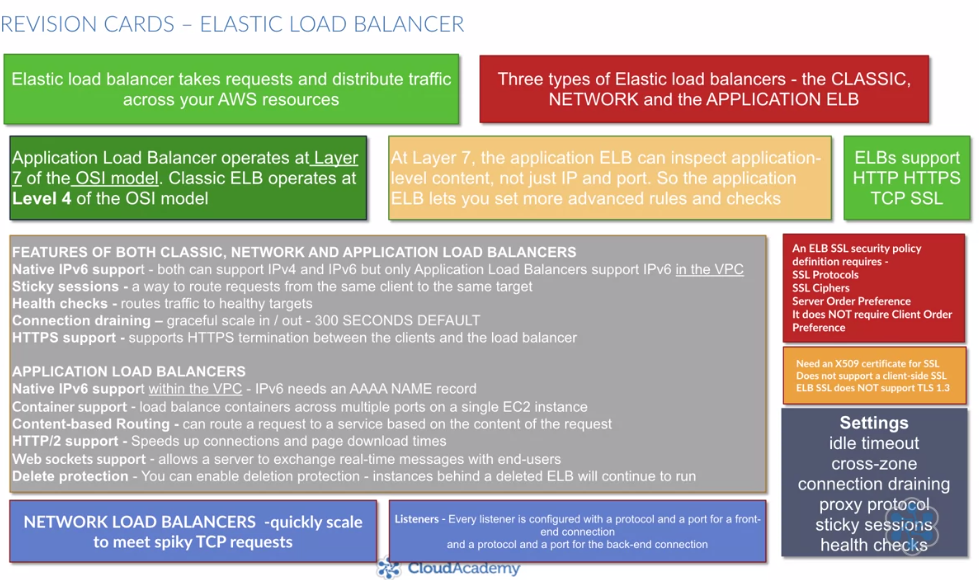  
  
### Route 53
  
### CLoud Watch
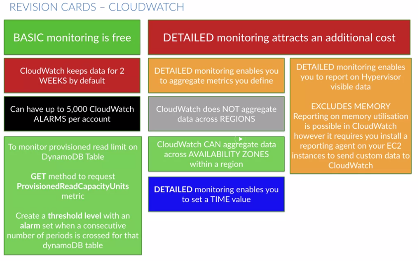  

## Exam Prep - Domain Two  
### Implementation and Deployment  
  
  
  

## Chalk Talk
### Bastions Hosts and NAT Instances
  
  
  

## Exam Prep -  Domain Three
### Data Security
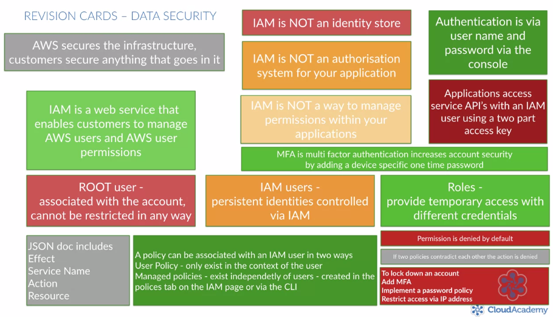  
  
