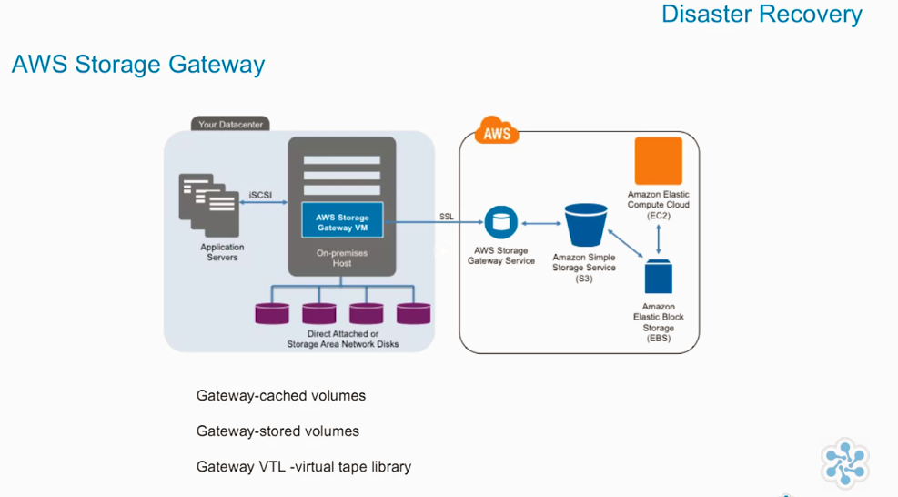
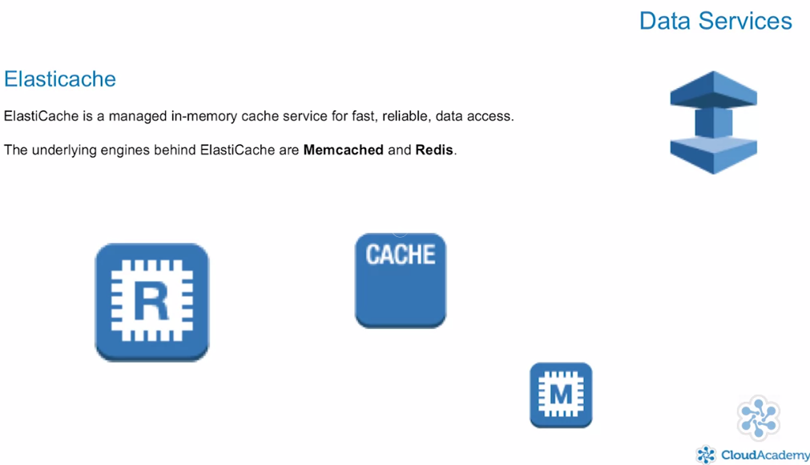
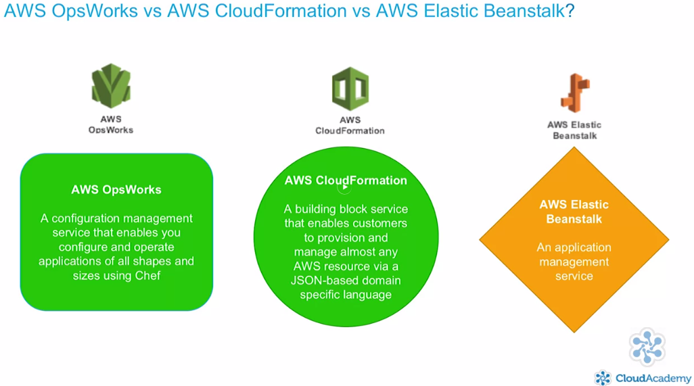
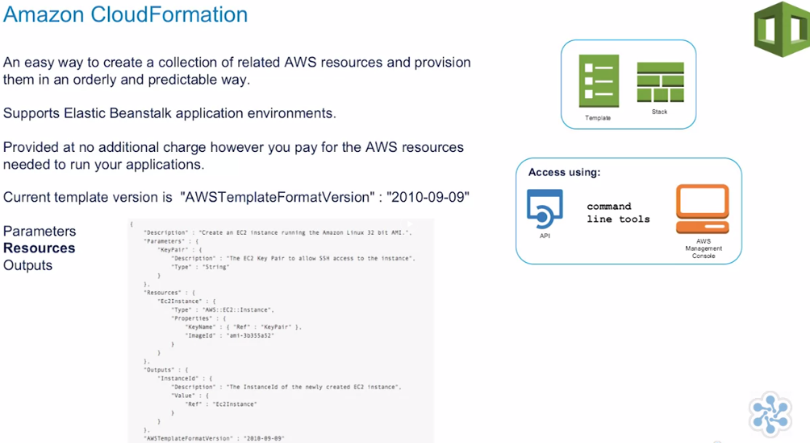
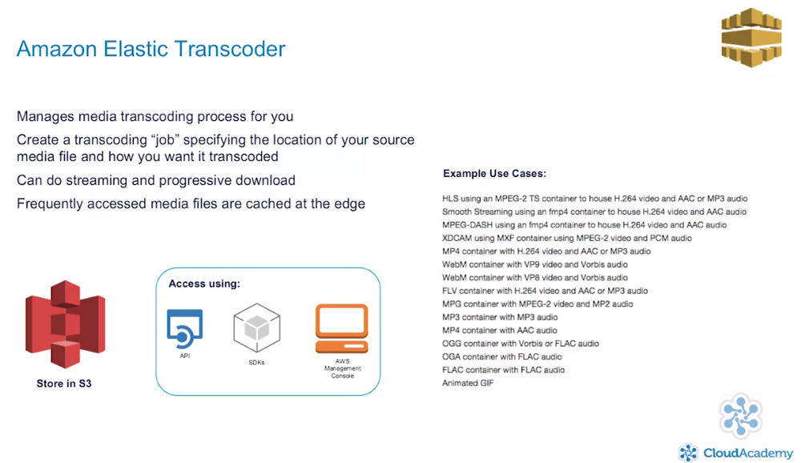
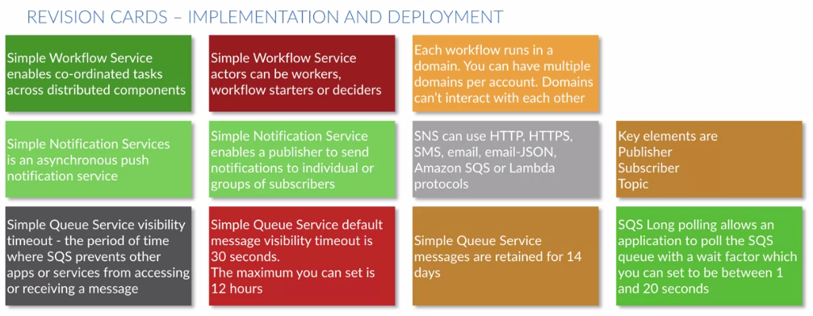

# Solution Architect Associate for AWS - 2017 Exam Primer

[Course at Cloudacademy.com](https://cloudacademy.com/amazon-web-services/solution-architect-associate-for-aws-course/)

## Latest Exam Primer
* AWS well architected framework pillars
  
* EC2 States
  
* EC2 States. Differences between stop-reboot-terminate
  
* Disaster Recovery RTO & RPO
  
* rto-rpo
  
* Disaster Recovery Comparission
  
* Disaster Recovery Aws Storage Gateway
  
* Disaster Recovery Replication
  
* High Availabiliti Top Ten
  
* Monitoring
  
* AWS Cloud Watch
  
* auto-scaling
  
* Security Responsability
  
* Security on the cloud
  
* Federate Identity
  
* Federate Identity. Aws Cognito
  
* Aws Cognito
  
* Platform Compliance
  
* SSL on ELB
  
* Aws Encryption Services
  
* Aws Encryption Options
  
* Thread Mitigation
  
* Aws S3
  
* Aws S3 Classes
  
* Aws S3 points to remember
  
* EBS
  
* Glacier
  
* Elasticache
  
* Redshift
  
* EMP. Elastic Map Reduce
  
* Kinesis
  
* Deploy. OpsWork. CloudFormation. Elastic Beanstalk
  
* CloudFormation
  
* Amazon Api Gateway
  
* SQS
  
* SNS
  
* SWF
  
* SES
  
* Amazon Elastic Transcoder
  
* Amazon Lambda
  
* Amazon Appstream
  
* Amazon Workspaces
  
* Amazon Data Pipelina
  
* Amazon ECS
  

## Exam Prep - Domain One
### High Availability
  
### Auto Scaling
  
### ELB
  
  
### Route 53
  
### CLoud Watch
  

## Exam Prep - Domain Two  
### Implementation and Deployment  
  
  
  

## Chalk Talk
### Bastions Hosts and NAT Instances
  
  
  

## Exam Prep -  Domain Three
### Data Security
  
  
