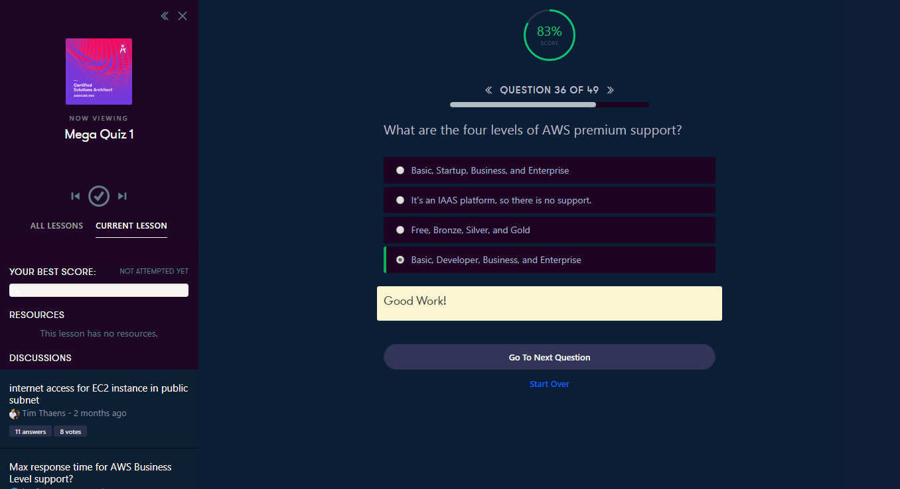

<a id="top" />

# Certified Solutions Architect - Associate 2018
[Course Dashboard](https://acloud.guru/course/aws-certified-solutions-architect-associate/dashboard)

## Content

* [All Content Quizzes](#quizzies)

* [Summaries & Exam Tips. IAM-S3-EC2-R53-RDS-VPC-SQS-SWF-SNS-Kinesis](#summ)
  * [IAM](#summ-iam)
  * [Storage](#summ-storage)
  * [EC2](#summ-ec2)
  * [DNS - Rote 53](#summ-route53)
  * [Databases](#summ-ddbb)
  * [VPC](#summ-vpc)
  * [Application. SQS. SWF. SNS. Elastic Transcoder. Kinesis](#summ-app)

* [Overview of AWS Whitepapers](#wp)
  * [Security](#wp-security)
  * [Risk & Compliance WP](#wp-risk)
  * [Storage Options in the Cloud WP](#wp-storage)
  * [Architecting for the Cloud Best Practices WP](#wp-architecting)
  * [Exam Practicalities](#wp-exam)
  * [Mega Quizz](#wp-mega-quizz)

* [Well Architected Framework](#waf)
  * [Pillar One. Security](#waf-security)
  * [Pillar Two. Reliability](#waf-rel)
  * [Pillar Three. Performance Efficiency](#waf-performance)
  * [Pillar Four. Cost Optimization](#waf-cost)
  * [Pillar Five. Operational Excellence](#waf-operational)
  * [Summary](#waf-summary)

* [Additional Exam Tips](#tips)
  * [Exam Tips based on student feedback](#tips-student)
  * [AWS Organizations & Consolidated Billing](#tips-billing)
  * [AWS Organizations Lab](#tips-org-lab)
  * [Cross Account Access](#tips-cross-account)
  * [Tagging & Resource Groups](#tips-tagging)
  * [VPC Peering](#tips-vpc-peering)
  * [Direct Connect](#tips-direct-connect)
  * [STS Security Token Service](#tips-sts)
  * [Active Directory Integration](#tips-ad)
  * [Workspaces](#tips-worspaces)
  * [ECS Part 1](#tips-ecs-1)
  * [ECS Part 2](#tips-ecs-2)

* [Thank You, Good Luck & Coming Soon](#soon)
  * PENDING

## All Content Quizzes

<a href="#top">Top</a>

.png)
---
.png)
---
.png)
---
.png)
---
.png)
---
.png)
---
.png)
---
.png)
---
.png)
---
.png)
---
.png)
---
.png)
---
.png)
---
.png)
---
.png)
---
.png)
---
.png)
---
.png)
---
.png)
---
.png)
---
.png)
---
.png)
---
.png)
---
.png)
---

## Summaries & Exam Tips 
## IAM, Storage, EC2, DND [Route53], Databases, VPC, SQS, SWF, SNS & Kinesis

<a href="#top">Top</a>

### IAM 

<a href="#top">Top</a>

---

---

---

### Storage 

<a href="#top">Top</a>

---

---

---

---

---

---

---

---

---

---

---

---

---

---

---

---

---

### EC2 

<a href="#top">Top</a>

---

---

---

---

---

---

---

---

---

---

---

---

---

---

---

---

---

---

### DNS - Rote 53 

<a href="#top">Top</a>

---

---

### Databases 

<a href="#top">Top</a>

---

---

---

---

---

---

---

---

---

### VPC 

<a href="#top">Top</a>

---

---

---

---

---

---

---

---

---

---

### Application. SQS. SWF. SNS. Elastic Transcoder. Kinesis 

<a href="#top">Top</a>

---

---

---

---

---

---

---

---

---

---

---

---

---

---

---

## Overview of AWS Whitepapers 

<a href="#top">Top</a>

---

---

---

---

---

---

---

### Security 

<a href="#top">Top</a>

---

---

---

---

---

---

---

---

---

---

---

---

---

---

---

---

---

---

---

---

---

---

### Risk & Compliance WP 

<a href="#top">Top</a>

---

---

---

---

### Storage Options in the Cloud WP 

<a href="#top">Top</a>

---

---

---

---

---

---

---

---

### Architecting for the Cloud Best Practices WP 

<a href="#top">Top</a>

---

---

---

---

---

---

---

---

### Exam Practicalities 

<a href="#top">Top</a>

---

---

---

---

### Mega Quizz 

<a href="#top">Top</a>

---

---

---

---

---

---

---

---

---

---

---

---

---

---

---

## Well Architected Framework

<a href="#top">Top</a>

---

---

---

---

### Pillar One. Security 

<a href="#top">Top</a>

---

---

---

---

---

---

---

---

---

---

---

---

---

---

---

---

---

### Pillar Two. Reliability 

<a href="#top">Top</a>

---

---

---

---

---

---

---

---

---

---

---

---

---

---

---

### Pillar Three. Performance Efficiency 

<a href="#top">Top</a>

---

---

---

---

---

---

---

---

---

---

---

---

---

---

---

---

---

---

---

### Pillar Four. Cost Optimization 

<a href="#top">Top</a>

---

---

---

---

---

---

---

---

---

---

---

---

---

---

---

### Pillar Five. Operational Excellence

<a href="#top">Top</a>

---

---

---

---

---

---

---

---

---

---

---

---

---

---

---

---

---

---

---

### Summary

<a href="#top">Top</a>

---
Nothing to add!

## Additional Exam Tips

<a href="#top">Top</a>

### Exam Tips based on student feedback

<a href="#top">Top</a>

---

---

---

---

---

---

---

### AWS Organizations & Consolidated Billing

<a href="#top">Top</a>

---

---

---

---

---

---

---

---

---

---

---

### AWS Organizations Lab

<a href="#top">Top</a>

---

---

---

---

### Cross Account Access

<a href="#top">Top</a>

---

---

### Tagging & Resource Groups

<a href="#top">Top</a>

---

---

---

---

---

---

---

---

### VPC Peering

<a href="#top">Top</a>

---

---

---

---

---

### Direct Connect

<a href="#top">Top</a>

---

---

---

---

---

### STS Security Token Service

<a href="#top">Top</a>

---

---

---

---

---

---

---

---

---

### Active Directory Integration

<a href="#top">Top</a>

---

### Workspaces

<a href="#top">Top</a>

---

---

### ECS Part 1

<a href="#top">Top</a>

---

---

---

---

---

---

---

---

---

---

### ECS Part 2

<a href="#top">Top</a>

---

---

---

---

---

---

---

---

---

---

---

---

---

---

---

---

## Thank You, Good Luck & Coming Soon

<a href="#top">Top</a>

coming-soon

The End