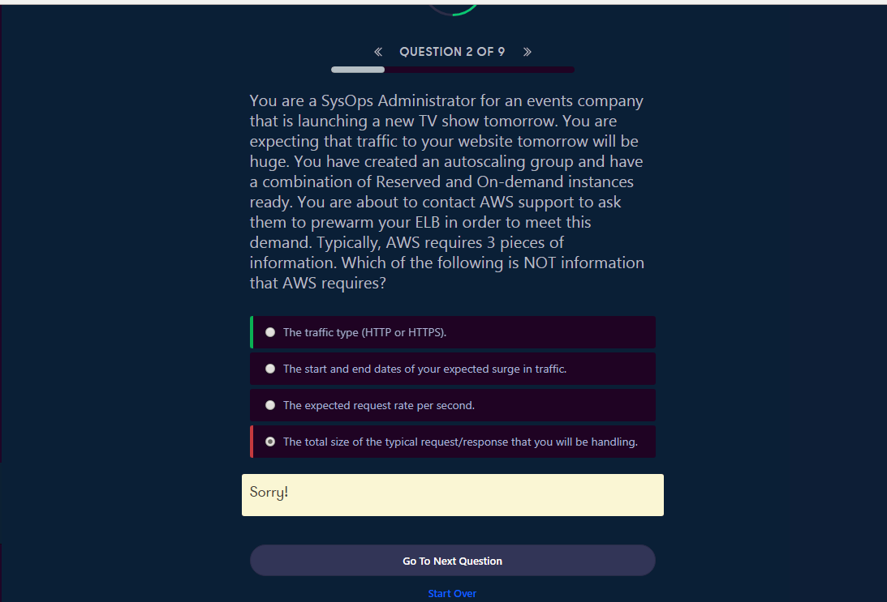
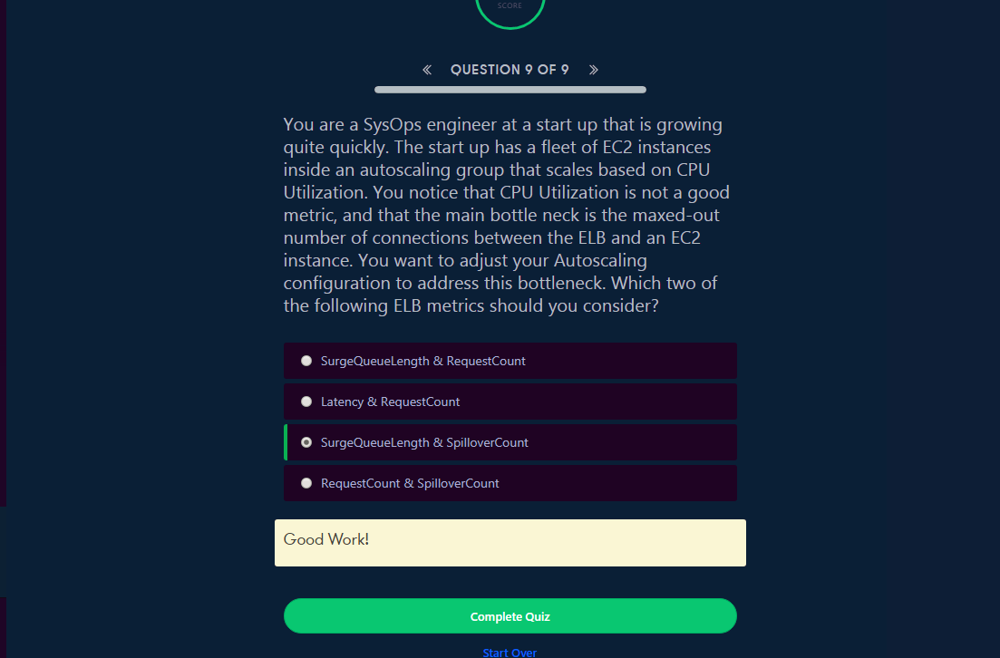
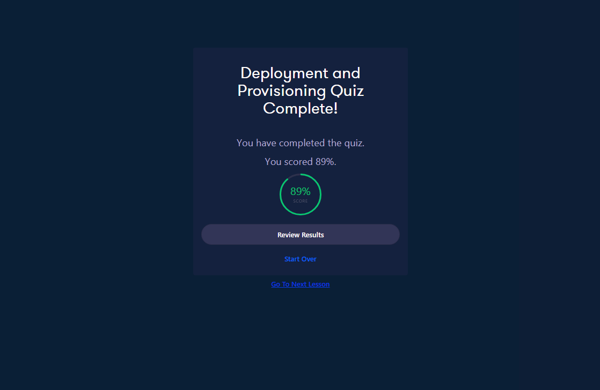

<a id="top" />

# Chapter 4. Deployment & Provisioning
[Course Dashboard](https://acloud.guru/course/aws-certified-sysops-administrator-associate/dashboard)

## Content

* [Root Access to AWS Services](#root)
* [Elastic Load Balancer Configuration](#elb)
* [Pre-warming - Elastic Load Balancers](#pre-warm)
* [Deployment and Provisioning Quiz](#quiz)

## Lectures

### Root Access to AWS Services

<a href="#top">Top</a>

---

---

### Elastic Load Balancer Configuration

<a href="#top">Top</a>

---

---

---

---

---

---

---

---

---

---

---

---

---

---

---

---

---

### Pre-warming - Elastic Load Balancers

<a href="#top">Top</a>

---

---

### Deployment and Provisioning Quiz

<a href="#top">Top</a>

---

---

---

---

---

The End

<a href="#top">Top</a>
