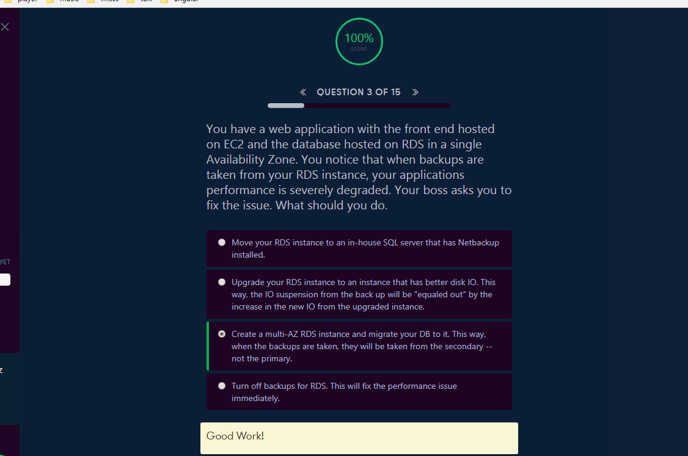
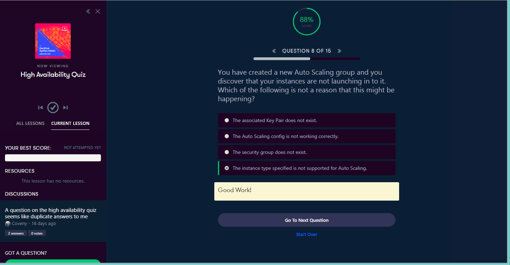
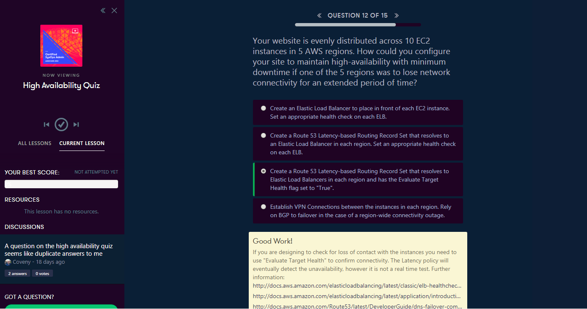

<a id="top" />

# Chapter 3. High Availability
[Course Dashboard](https://acloud.guru/course/aws-certified-sysops-administrator-associate/dashboard)

## Links
* [Architecting for the Cloud - AWS Best Practices - February 2016](https://d0.awsstatic.com/whitepapers/AWS_Cloud_Best_Practices.pdf)
* [Previous Generation Instances](https://aws.amazon.com/ec2/previous-generation/)
* [Amazon EC2 Instance Types](https://aws.amazon.com/ec2/instance-types/)
* [Cloud Databases](https://aws.amazon.com/products/databases/)
* [Amazon RDS Read Replicas](https://aws.amazon.com/rds/details/read-replicas/)
* [Amazon Aurora – Relational Database Built for the Cloud](https://aws.amazon.com/rds/aurora/)
* [Working with Read Replicas of MariaDB, MySQL, and PostgreSQL DB Instances](https://docs.aws.amazon.com/AmazonRDS/latest/UserGuide/USER_ReadRepl.html)

## Content

* [Elasticity And Scalability 101](#intro)
* [Scale Up or Scale Out?](#scale)
* [RDS and Multi-AZ Failover](#multi-az)
* [RDS and Using Read Replicas](#read-replicas)
* [RDS Multi-AZ and Read Replicas Lab](#rds)
* [Using Bastion Hosts and High Availability](#bastions-ha)
* [Troubleshooting and Potential Autoscaling Issues](#troubleshooting-autoscaling)
* [High Availability Quiz](#quiz)

## Lectures

### Elasticity And Scalability 101

<a href="#top">Top</a>

---

---

---

---

---

### Scale Up or Scale Out?

<a href="#top">Top</a>

---

---

---

---

---

---

---

---

---

### RDS and Multi-AZ Failover

<a href="#top">Top</a>

---

---

---

---

### RDS and Using Read Replicas

<a href="#top">Top</a>

---

---

---

---

---

---

---

---

---

### RDS Multi-AZ and Read Replicas Lab

<a href="#top">Top</a>

---

---

---

---

---

---

---

---

---

---

---

---

---

---

---

---

---

---

---

---

---

---

---

---

---

---

---

---

---

---

---

---

---

---

---

---

---

---

---

---

---

---

---

---

---

---

---

---

---

---

---

---

---

---

### Using Bastion Hosts and High Availability

<a href="#top">Top</a>

---

---

---

### Troubleshooting and Potential Autoscaling Issues

<a href="#top">Top</a>

---

---

### High Availability Quiz

<a href="#top">Top</a>

---

---

---

---

---

---

---

---

The End

<a href="#top">Top</a>
